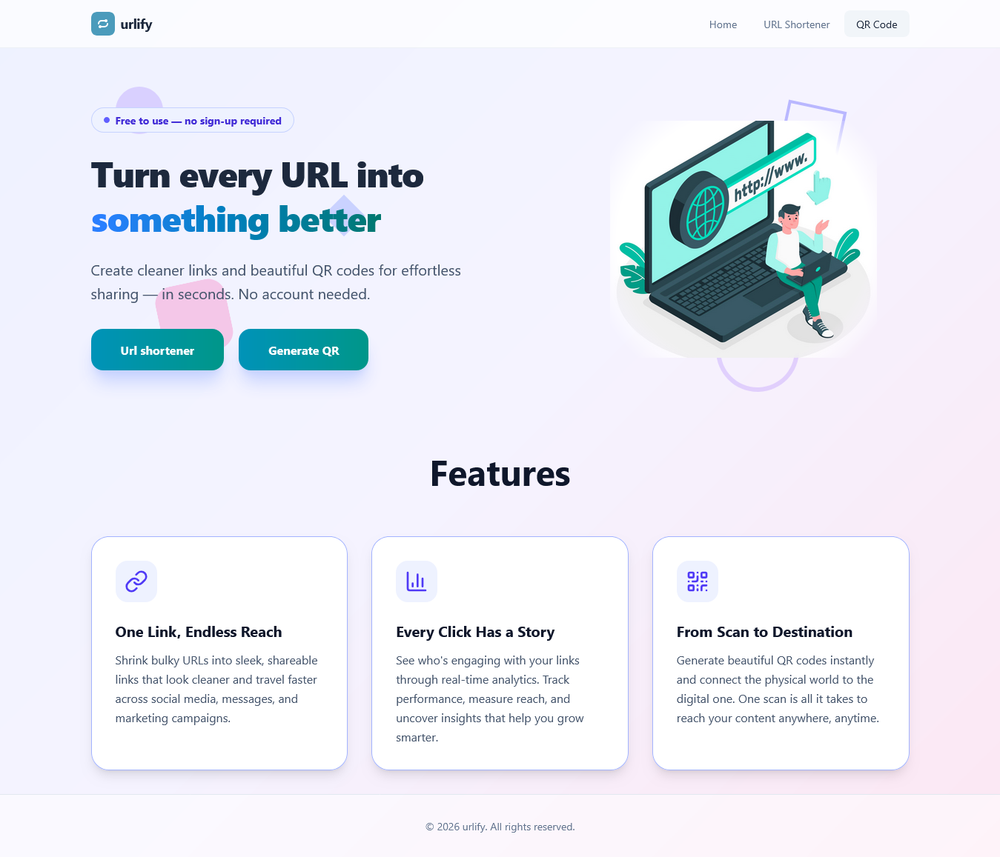
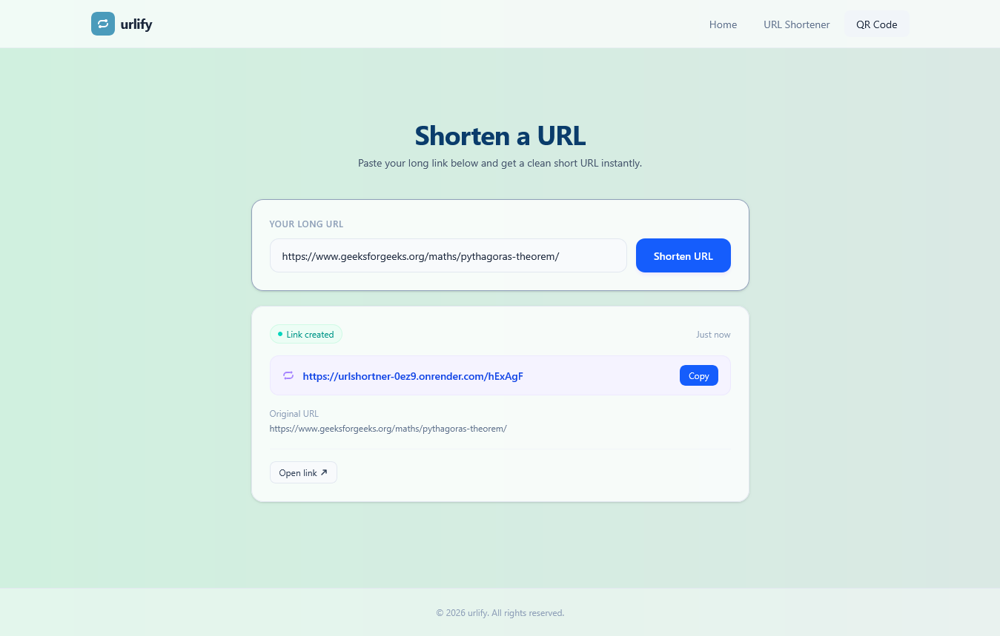
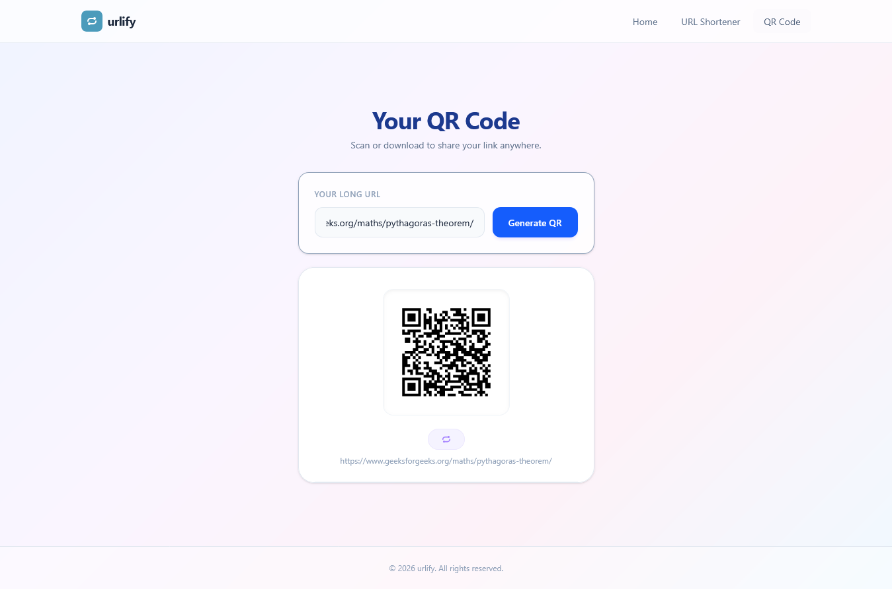

# 🚀 URLify – URL Shortener & QR Code Generator

A fully responsive URL Shortener and QR Code Generator built using React JS, Tailwind CSS, Node.js, Express.js, and MongoDB.

URLify allows users to convert long URLs into short, shareable links and instantly generate QR codes from any URL. The application features a modern UI, seamless navigation, real-time feedback, and a responsive design optimized for all devices.

---

## 📸 Screenshot

<table align="center">
<tr>
  <th>Home Page</th>
  <th>URL Shortener</th>
</tr>
<tr>
  <td align="center">
    
  </td>
  <td align="center">
    
  </td>
</tr>
</table>

<br/>

<table align="center">
<tr>
  <th>QR Code Generator</th>
</tr>
<tr>
  <td align="center">
    
  </td>
</tr>
</table>

---

## 🌐 Live Demo

The project is live and can be viewed here:

[URLify](https://url-shortner-ten-neon.vercel.app/)

---

## ✨ Features

### 🏠 Home Page

* Modern and responsive landing page
* Two dedicated action buttons:

  * 🔗 URL Shortener
  * 📱 QR Code Generator
* Smooth navigation between pages
* Clean and user-friendly interface

### 🔗 URL Shortener

* Convert long URLs into short and shareable links
* Unique short URLs generated using NanoID
* URL validation using Zod
* 📋 Copy Button for one-click copying
* 🌐 Open Link Button to directly visit the shortened URL
* Instant response and clean UI
* Success and error notifications using React Hot Toast

### 📱 QR Code Generator

* Generate QR codes instantly from any valid URL
* Real-time QR code preview
* Simple and intuitive user experience
* Fast QR code generation

### 🎨 User Interface

* Modern icons using Lucide React
* Fully responsive layout
* Mobile-first design
* Optimized for desktop, tablet, and mobile devices

---

## 🛠️ Technologies Used

### Frontend

* React JS
* Tailwind CSS
* JavaScript (ES6+)
* HTML5
* React Router DOM
* Lucide React
* React Hot Toast

### Backend

* Node.js
* Express.js

### Database

* MongoDB
* Mongoose

### Validation & Utilities

* Zod
* NanoID

### QR Code Functionality

* QR Code Generation Library

---

## ⚙️ Backend Functionality

* Handles URL shortening requests
* Generates unique short URLs using NanoID
* Validates incoming URLs using Zod
* Stores URL mappings in MongoDB
* Redirects shortened URLs to their original destination
* Generates QR codes for URLs
* Provides REST APIs for frontend communication

---

## 📂 Project Structure

```bash
urlify/
│
├── backend/
│   ├── controllers/
│   │   └── urlController.js
│   │
│   ├── models/
│   │   └── urlModel.js
│   │
│   ├── routes/
│   │   ├── redirectRoute.js
│   │   ├── qrRoute.js
│   │   └── urlRoute.js
│   │
│   ├── index.js
│   ├── package.json
│   ├── package-lock.json
│   └── .env
│
├── frontend/
│   ├── src/
│   │   ├── components/
│   │   │   ├── Home.jsx
│   │   │   ├── Navbar.jsx
│   │   │   ├── QRCode.jsx
│   │   │   └── Short.jsx
│   │   │
│   │   ├── App.jsx
│   │   ├── main.jsx
│   │   └── index.css
│   │
│   ├── package.json
│   ├── package-lock.json
│   └── vite.config.js
│
└── README.md
```

---

## ⚙️ Getting Started

Follow these steps to run the project locally:

### Clone the Repository

```bash
git clone https://github.com/aru-shi2/urlShortner.git
```

### Navigate to the Project Directory

```bash
cd urlify
```

### Install Frontend Dependencies

```bash
cd frontend
npm install
```

### Install Backend Dependencies

```bash
cd ../backend
npm install
```

### Configure Environment Variables

Create a `.env` file inside the backend folder:

```env
MONGO_URI=your_mongodb_connection_string
```

### Start Backend Server

```bash
npm start
```

### Start Frontend Development Server

```bash
cd ../frontend
npm run dev
```
